# Digital-Library-Portal
A production-style serverless web application deployed on AWS to demonstrate secure content delivery, training registration, digital library management, enquiry submission, email notification, and cloud-native serverless architecture.
## Features
This portal will provide: 

•	Digital Library 

•	Publication Catalogue 

•	Research Repository 

•	Training Material Request 

## AWS Architecture
Internet Users

       │
       
Route53

       │
       
CloudFront (HTTPS)

       │
       
Amazon S3 Static Website

       │
       
────────────────────────────────

       │
       
API Gateway

       │
       
Lambda

       │
       
 ├───────────────┐
 
 │               │
 
SES          DynamoDB

 │               │
 
Notification Contact /
Emails         

CloudWatch

Monitoring + Logs

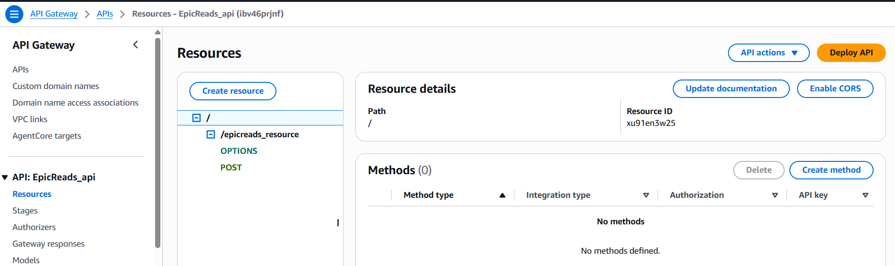

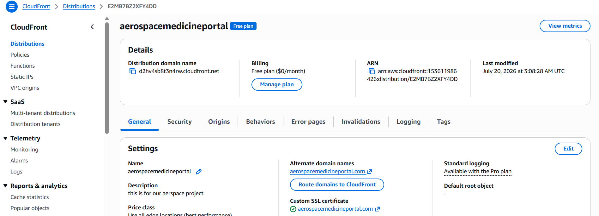

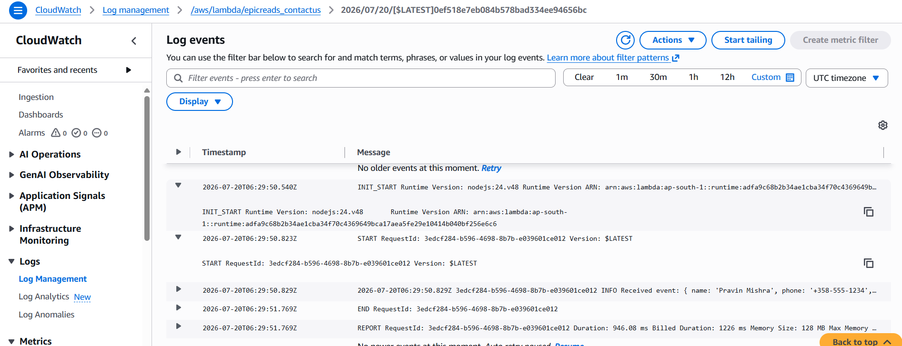

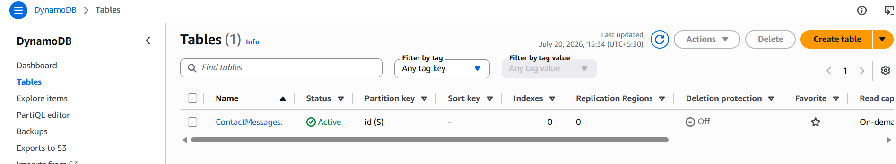

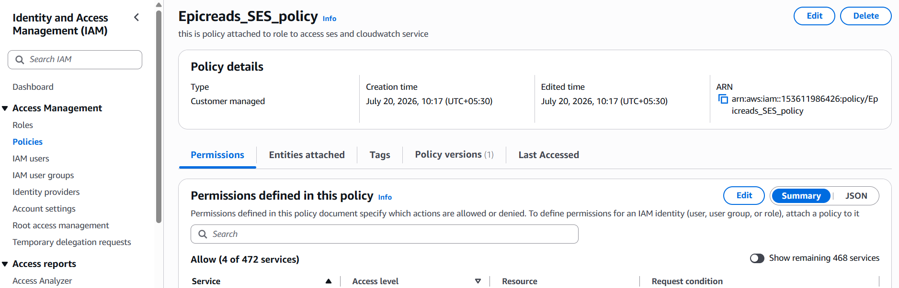

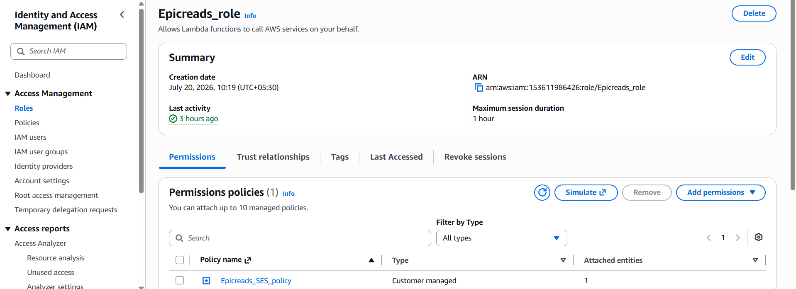

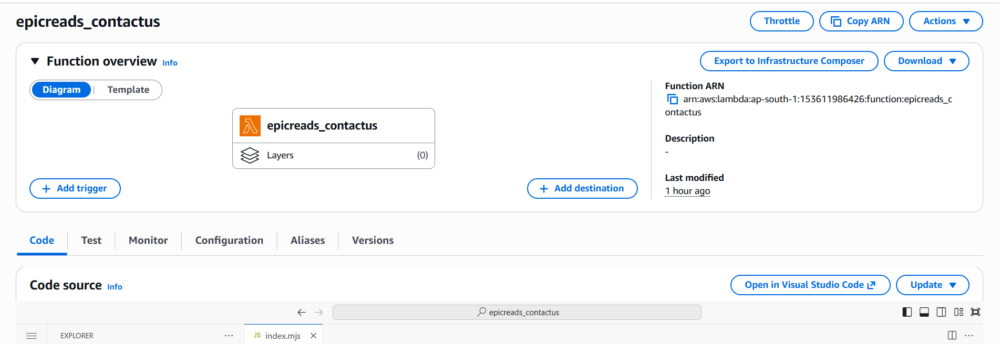

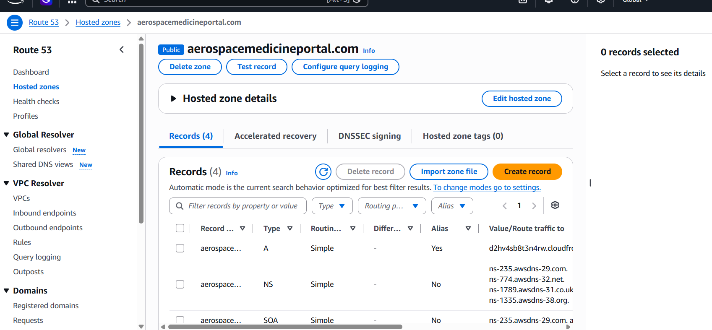

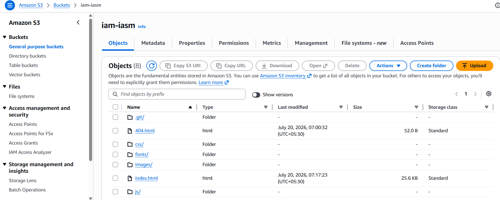

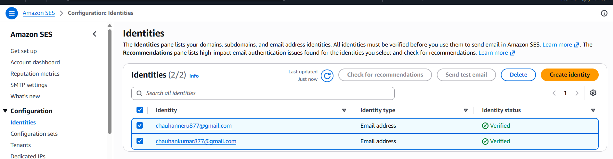

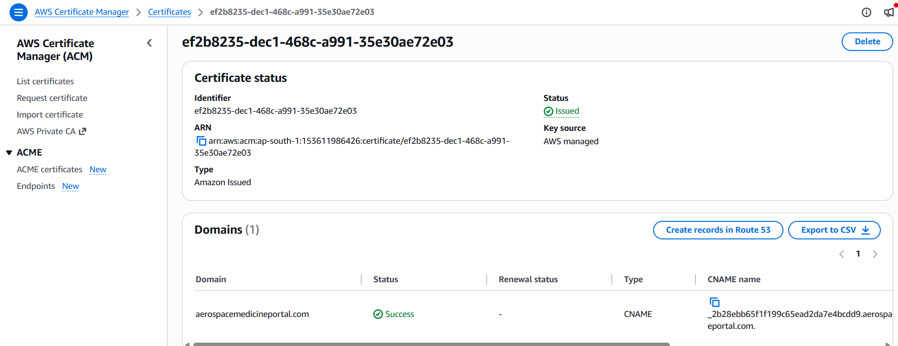

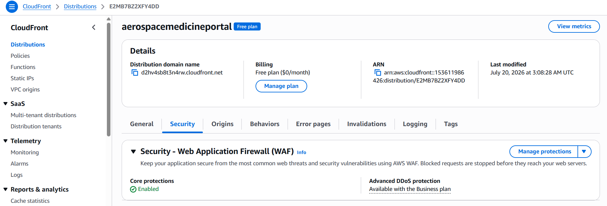

